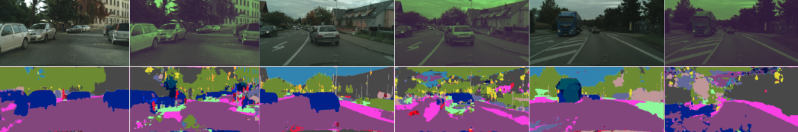
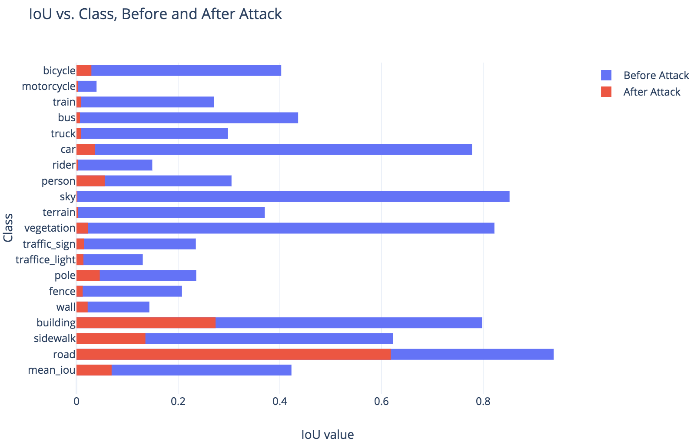

# Malicious Autoencoder

A way to discover faults in the training dataset and model. The malicious autoencoder, or attacker, learns small transformations to the input that cause the base or victim model to fail.

This repository was modified from an [open source](https://github.com/davidtvs/PyTorch-ENet) version of the ENet architecture. The changes made to this repository that enables the training of a malicious autoencoder are in the following files:
  - mal.py
  - data/cityscapes.py
  - args.py
  - main.py
  - models/enet.py
  - test.py
  - train.py
  - README.md

The rest of the repository is due to [davidtvs](https://github.com/davidtvs/PyTorch-ENet)

## Dataset Downnload Instructions

We used the Cityscapes dataset, which can be found [here](https://www.cityscapes-dataset.com/).
1. Create a Cityscapes account.
2. [Download](https://www.cityscapes-dataset.com/downloads/) the gtFine_trainvaltest.zip and leftImg8bit_trainvaltest.zip. The former file contains the segmentation labels, and the latter contains the images.
3. Create the folder ../Cityscapes
4. Unzip the two files into ../Cityscapes. Contents of ../Cityscapes should be
     - gtFine
     - leftImg8bit

## Instructions to replicate results

1. After downloading the dataset, install the packages listed in requirements.txt
2. You can now invoke the main.py from the command: ```python main.py  --help```
3. (Optional) Retrain the base model (current model saved to save/ENet.pt): ```python main.py --train --reload-class-weights```
4. (Optional) Retrain the attacker (saved to save/mal.pt): ```python main.py --trainmal```
5. Save results the results to the results directory: ```python main.py --dis```

## Example Results


Visualizations of the Original image and ENet segmentations, with the transformed image and its segmentations. The first row indicates images, the second row indicates segmentation. The columns alternate between original and attacked, with the first column being the original image and label. The first two columns come from the training set, and the rest come from the validation set.


Performance of the IoU metric before and after the Enet attack. The IoU metric is defined as the area of the intersection between the predicted segmentation and the actual segmentation, divided by the union of the predicted and actual. An IoU of 1 indicates perfect segmentation for a particular class, while 0 indicates failure. Credit: Blair Chen

# [PyTorch-ENet](https://github.com/davidtvs/PyTorch-ENet)

PyTorch (v1.0.0) implementation of [*ENet: A Deep Neural Network Architecture for Real-Time Semantic Segmentation*](https://arxiv.org/abs/1606.02147), ported from the lua-torch implementation [ENet-training](https://github.com/e-lab/ENet-training) created by the authors.

This implementation has been tested on the CamVid and Cityscapes datasets. Currently, a pre-trained version of the model trained in CamVid and Cityscapes is available [here](https://github.com/davidtvs/PyTorch-ENet/tree/master/save).


|                               Dataset                                | Classes <sup>1</sup> | Input resolution | Batch size | Epochs |   Mean IoU (%)    | GPU memory (GiB) | Training time (hours)<sup>2</sup> |
| :------------------------------------------------------------------: | :------------------: | :--------------: | :--------: | :----: | :---------------: | :--------------: | :-------------------------------: |
| [CamVid](http://mi.eng.cam.ac.uk/research/projects/VideoRec/CamVid/) |          11          |     480x360      |     10     |  300   | 52.46<sup>3</sup> |       4.2        |                 1                 |
|          [Cityscapes](https://www.cityscapes-dataset.com/)           |          19          |     1024x512     |     4      |  300   | 59.40<sup>4</sup> |       5.4        |                24                 |

<sup>1</sup> When referring to the number of classes, the void/unlabeled class is always excluded.<br/>
<sup>2</sup> Just for reference since changes in implementation, datasets, and hardware can lead to very different results. Reference hardware: Nvidia GTX 1070 and an Intel Core i5-4570 3.2GHz. You can also train for 100 epochs or so and get similar mean IoU (± 2%).<br/>
<sup>3</sup> Test set.<br/>
<sup>4</sup> Validation set.


## Installation

1. Python 3 and pip.
2. Set up a virtual environment (optional, but recommended).
3. Install dependencies using pip: ``pip install -r requirements.txt``.


## Usage

Run [``main.py``](https://github.com/davidtvs/PyTorch-ENet/blob/master/main.py), the main script file used for training and/or testing the model. The following options are supported:

```
python main.py [-h] [--mode {train,test,full}] [--resume]
               [--batch-size BATCH_SIZE] [--epochs EPOCHS]
               [--learning-rate LEARNING_RATE] [--lr-decay LR_DECAY]
               [--lr-decay-epochs LR_DECAY_EPOCHS]
               [--weight-decay WEIGHT_DECAY] [--dataset {camvid,cityscapes}]
               [--dataset-dir DATASET_DIR] [--height HEIGHT] [--width WIDTH]
               [--weighing {enet,mfb,none}] [--with-unlabeled]
               [--workers WORKERS] [--print-step] [--imshow-batch]
               [--device DEVICE] [--name NAME] [--save-dir SAVE_DIR]
```

For help on the optional arguments run: ``python main.py -h``


### Examples: Training

```
python main.py -m train --save-dir save/folder/ --name model_name --dataset name --dataset-dir path/root_directory/
```


### Examples: Resuming training

```
python main.py -m train --resume True --save-dir save/folder/ --name model_name --dataset name --dataset-dir path/root_directory/
```


### Examples: Testing

```
python main.py -m test --save-dir save/folder/ --name model_name --dataset name --dataset-dir path/root_directory/
```


## Project structure

### Folders

- [``data``](https://github.com/davidtvs/PyTorch-ENet/tree/master/data): Contains instructions on how to download the datasets and the code that handles data loading.
- [``metric``](https://github.com/davidtvs/PyTorch-ENet/tree/master/metric): Evaluation-related metrics.
- [``models``](https://github.com/davidtvs/PyTorch-ENet/tree/master/models): ENet model definition.
- [``save``](https://github.com/davidtvs/PyTorch-ENet/tree/master/save): By default, ``main.py`` will save models in this folder. The pre-trained models can also be found here.

### Files

- [``args.py``](https://github.com/davidtvs/PyTorch-ENet/blob/master/args.py): Contains all command-line options.
- [``main.py``](https://github.com/davidtvs/PyTorch-ENet/blob/master/main.py): Main script file used for training and/or testing the model.
- [``test.py``](https://github.com/davidtvs/PyTorch-ENet/blob/master/test.py): Defines the ``Test`` class which is responsible for testing the model.
- [``train.py``](https://github.com/davidtvs/PyTorch-ENet/blob/master/train.py): Defines the ``Train`` class which is responsible for training the model.
- [``transforms.py``](https://github.com/davidtvs/PyTorch-ENet/blob/master/transforms.py): Defines image transformations to convert an RGB image encoding classes to a ``torch.LongTensor`` and vice versa.
